## General Comments

Before moving on to working with Gitub, let's get some experience working with Git on your machine. This will:
1) Allow you to experiment freely with the confidence that you won't inadvertantly 'mess something up' in the functioning Gitub UASAL repositories (you really can't, but, heh, let's grab confidence where we can...), and:
2) Will give you experience with command line Git, which is an essential fundamental.

This project asks you to create a personal log (or journal), and is divided into two parts. 

**First** is a tutorial that will show you the basics of using CLI (Command Line Interface) Git, and will demonstrate how to set up a Git directory for your log, how to make and modify a few log entries, how to modify those entries, and how to  examine those modifications. The tutorial looks long, but should take you at most an hour or two to complete.

**Second** is the project itself. The project can be as simple and short or as long and detailed as you like. If you've never kept a personal log before, maybe this will encourage you to start. If you have, this will introduce you to a new, easy and flexible way of journaling.

It is also parallel to another project that will involve group journaling on GitHub.

A few notes: 

- You have to have installed and configured Git prior to working through this tutorial. If you have started working through the tutorials mentioned in the presentation, you should be at this point. If you are having difficulties with this, please contact me or come by my office and I'll help you with the install.

- You can call this project anything you want. I'm going to use *Git Log* as the name of my project, I'm going to use *GitLog* as the name of my project directory, and LogEntry001.txt, LogEntry002.txt, etc., for my daily entry file names. Feel free to use whatever you'd like, just be consistant. If you want to call the first file you make ''Entry1.txt", that's fine... just whenever I refer to LogEntry001.txt, make sure you use your Entry1.txt, and so on.

- Note that you should create the directory for this project sperate from any directories that you created for other Git work you have done. Creating a new Git repo as a subdirectory in an already existing Git repository directory causes issues. Also, you don't have to use the results of the tutorial as the beginning of your journal, although you certainly can. If you want to start fresh after completing the tutorial, feel free to create and initialize a fresh directory and work from there.

Let's, um... Git started!

## Part One: The tutorial

### Setup a Git Version Control Project

1) Create the directory for your project. It can be located anywhere within your directory structure. Mine is going to be `C:\Users\jajoh\PracticeRepo\GitLog`.

2) Initiate Git. Depending on how you installed Git, you'll either be using a MacOS Terminal, a Linux Terminal, a Windows command line, or a Windows Git Bash Terminal. Whatever your flavor, cd into your new directory, so something like this:
    ```
    cd C:\Users\jajohPracticeRepo\GitLog
    ```
3) Enter the following command:
    ```
    git init
    ```
4) Your directory is now version controlled by Git, and has become your *Working Directory*. You'll notice that Git created a `.git` directory within your project directory. (If you don't see it, it's because it's hidden. In MacOS or Linux, use the command `ls -a`. In Windows, use the command `dir /ah`. )  
5) In your new directory, create a text file. Mine is called `LogEntry001.txt`.
6) Using a text editor, write something in this file. (You can use the Windows native Notepad for this purpose, or any other text editor).
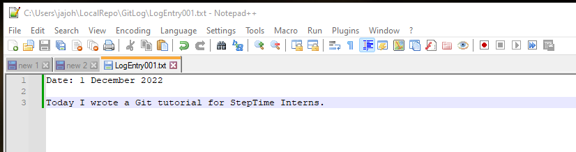
7) Git's 'status' command lists the state of files in your working directory. Enter the following command:
    ```
    git status
    ```
8) Git should respond by telling you that you have an *untracked file:* LogEntry001.txt, and then tell you to use "git add" to track, like this:  
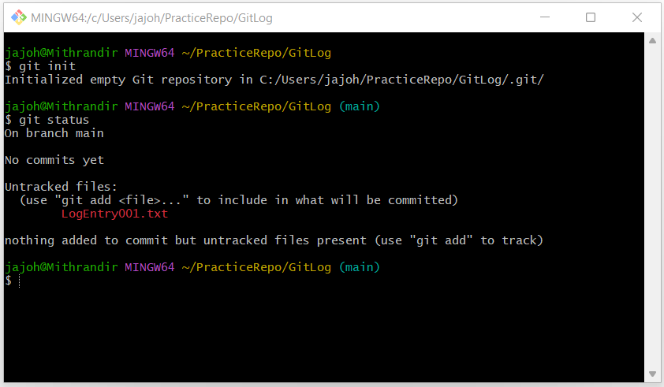
9) An 'untracked file is one that is still not 'versioned'... meaning that Git is aware it exists, but hasn't yet saved it in the repository database.

### Adding Project Files to be Version Controlled

1) At this point, your database does not contain any files. As we talked about in the first Git presentation, we have to move the file from the working directory to the Staging Area first, thereby telling Git we want to include it into the database during our next *Commit*. We do this by entering the command
    ```
    git add LogEntry001.txt
    ```

2) Git doesn't tell you anything after the `add` command, unless there is an error, so use `git status` again to check. you should see something like this:
	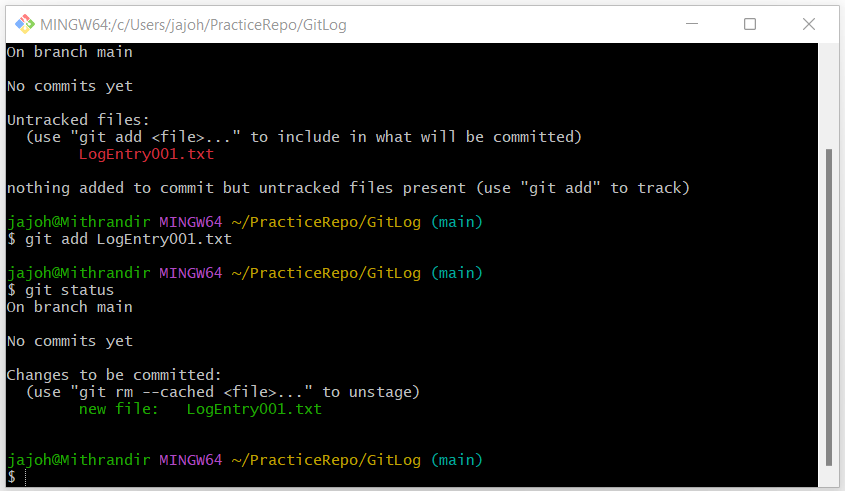
3) Note that at this stage, your database is still empty... no files have yet to be *committed*. Let's fix that now. Enter the following command with whatever message you'd like to save to describe the commit filled in after the '-m' switch:
   ```
   git commit -m "My first committed file"
   ```
4) Git will provide a bit of feedback in the terminal. But let's use another command to see what we just did. 
   ```
   git log
   ```
5) You'll see something similar to this:

6) The long hexadecimal string after the word 'commit' is the SA-1 commit hash, as we talked about in the presentation. It uniquely identifies this commit to the database... it is like a identification tag that labels this snapshot of the database. (If you want to see what the database contains when this commit/snapshot was taken, go to this identifier.)  But remember, the database only contains files that you have committed to it. Files that you have in your working directory, but have never tracked by adding to the staging area and committed, are not stored in the repository database. 

7) Take a screen shot of the output for future use.

8) Now, let's create another file with a bit of content. Mine is called `LogEntry002.txt`. Use your text editor to also add a bit of content to this file. Mine looks like this:
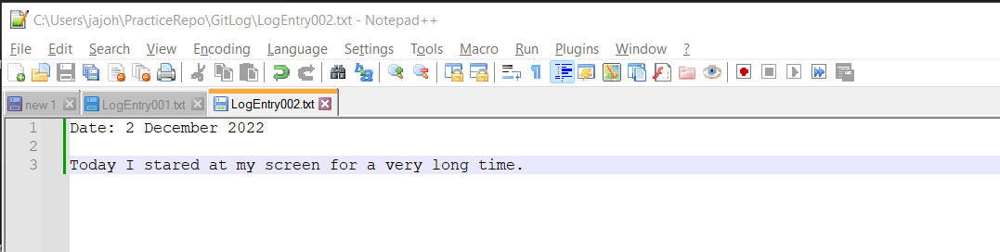
9) Let's also go back and make a change to our original file. I'm going to use my text editor to fix the error I made in LogEntry001.txt. Compare the new contents to the original file content image above. Do you see the difference?
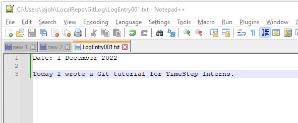
10) Now, before adding, check git's status again. When I do this, this is my output:
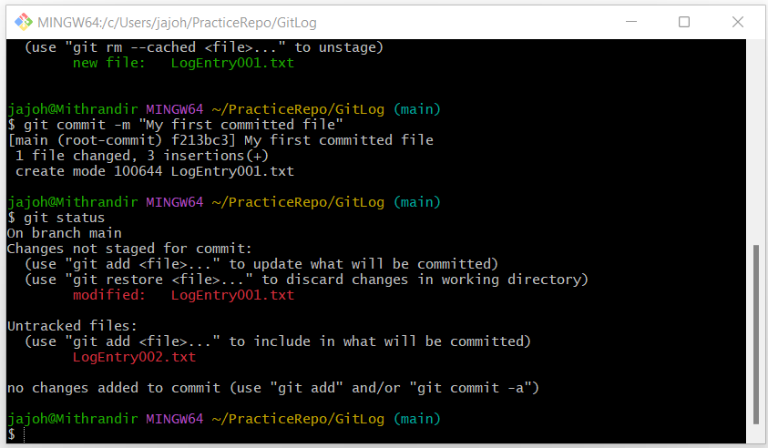
11) It tells me that I have modified a file in my working directory, as well as added a file that is not yet being tracked. Let's move them both to the staging area, and then commit them. Here's the commands I used to do this:
    ```
    git add LogEntry001.txt
    git add LogEntry002.txt
    git commit -m "added a new Log Entry, corrected mistake in previous Log Entry"
    ```
12) Next I'll check the log with `git log`:
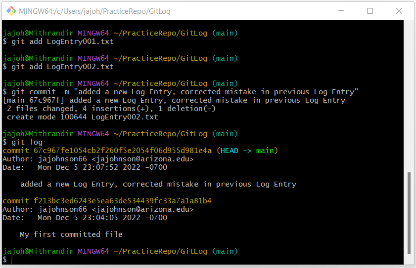

As expected, I see the entries for two seperate commits. Git output is 'most recent first', so the first is the commit we just processed, and the second is the original commit we used for LogEntry001.txt. (You can verify this by comparing the hash number  to the screenshot of the output from your first commit.)

###  Who Says Time Travel is Not Possible?

At some point, for multiple reasons that will become more clear over time, you may want to go back and see the status of your Git database at some previous point in time. The hash identifier is the key to doing this. 

Luckily, Git allows you to use an abbreviated version of the hash, so you don't have to tediously enter all 40 characters. Using the first 5 or 6 (just enough to assure it's unique) digits of the commit's hash, gotten from git log, you can go back to any point in your git history. Since we only have two commits at this point, we'll visit the first. Make sure you use the first digits of YOUR unique first commit hash. This is what I entered:

```
git checkout f213bc
```
 You will see something like this in your output:

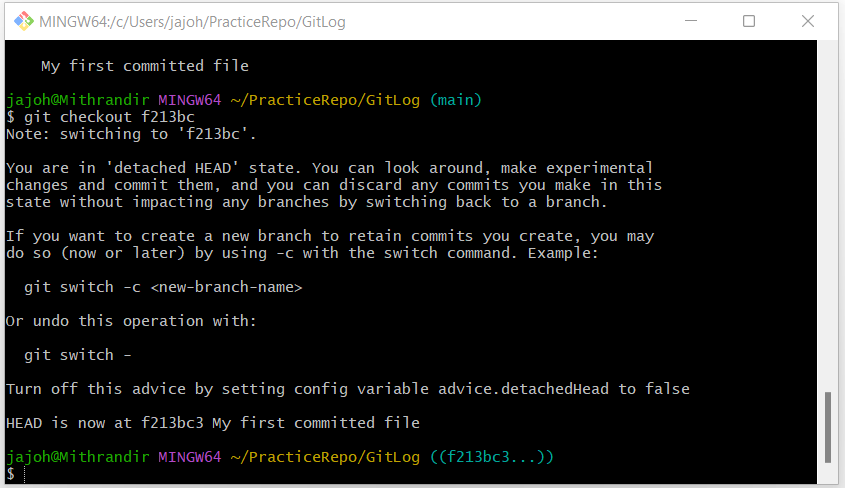

Notice it warns you about your head being detached? This has implications which we will discover a bit later. For now, 'HEAD' refers to the most recent commit on the current branch you are working on. Because we've gone back in time to an earlier commit, your HEAD has become, er detached. The Red Queen would be proud. Wile we are here, do two things:

1) Run `git status` .  After again informing you that you've lost your Head, it informs you 'nothing to commit, working tree clean'. This is because *as of the time you committed on this particular round*, all files that had been staged were moved to the database, leaving you with a clean working tree.
2) Now run `git log`. Notice this screen looks exactly like the first time you ran `git log` after your first commit? That's because it is. You have effectively wound the clock backwards. All traces of your second commit are gone. Also notice that git log informs you that this original commit is now the 'Head'. You have, in essence, started yourself off on a new **branch**.  As the message in the git checkout output told you, you can create a new branch at this point (or at any other point you have gone back to) by using the `git switch` command.

*Note: Git checkout is a powerful command with multiple functions. One of these is to allow you to directly checkout the state of your Git repository at any prior commit. This is the sense that we are using it in  now. Another use is to change to another branch. More about this when we discuss branches in the future.*

But before we get ahead of ourselves (heh heh), let's go back to where we were before. We use the same command we did before, `git checkout`, but this time, instead of identifying which commit we want to go to by digits from the hash, we tell it to go back to our *master branch*.

```
git checkout master
```

Note that if this gives an error, you may have named your 'master' branch something else, like 'main'. In that case, `git checkout main`. If you run `git log` now, you'll see something like:

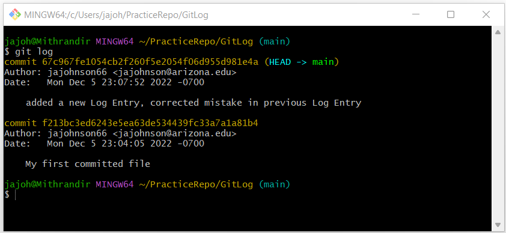

Which is exactly what you want to see. We are back to our current point in time. 

Now, before moving further, let's discuss a few solutions to common errors that may happen while working with your repository.

### Oops! I Really Didn't Mean to Delete That Log Entry

It happens. Files get erased, either by user or machine error. To show you some of the power of Git, let's simulate this.

1) Open your OS file manager. Go to your Git working directory. (Remember, your working directory is the directory you initialized with the `git init` command... in my case, it's the 'GitLog' directory. Don't confuse this with your Git Directory... this is the hidden `.git` directory that is *within* your working directory.) Mine looks like this:
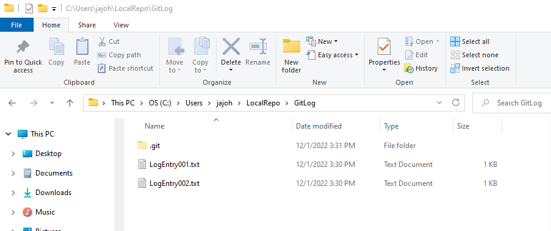

2) Now, delete your first log entry. And I mean... really delete it. Don't send it to the recycle bin... permanently delete it. Like the Windows hold-down-the-shift-button-while-hitting-delete kind of delete. (NOTE: Make sure you don't touch the '.git' directory!)

3) Now, go back to your Bash or Terminal program and enter `git status`. Git tells you that your file was deleted, and gives you a few options to restore it.  The command `git restore LogEntry001.txt` will work. Another option is to use another checkout functionality:  `git checkout LogEntry001.txt`. Try one, or delete twice and try both. After you've done it, use your OS File Manager to convince yourself that the file has been resurrected from the dead.

Suppose you make an even bigger mistake? Suppose you wipe out everything in your working directory (except for the .git directory of course)? Well, let's simulate THAT! 
1) Use the OS file manager to really, really wipe out both of your entries. LogEntry001.txt and LogEntry002.txt... gone.

2) `git status` will confirm that the tragedy has actually occurred.

3) Now, take a deep breath, and enter:
    ```
    git reset --hard
    ```
4) Go back and check out file manager. Your files have been resurrected! 

By the way, this command... the hard git reset... will remove any changes you have made *since the last commit*. This includes accidental erasures, changes to files in your working directory that you have yet to commit, etc.

### Comparing Files to Find Changes

Another thing that Git allows you to do is see the changes in your files between different commits. 

The command `diff` allows you to actually see the changes you've made to your files, but there are several ways to use it.  

If you just run `git diff` without arguments, it will compare the changes between your current working directory (specifically changes to files *before they have been staged*) and the previous commit. Let me put this a different way for clarity. Suppose you have made changes to a file. If you want to see the difference between the last committed version your files and the files as you have just altered them... use `git diff` with no arguments. Note that this will show you the changes in all files that were altered but not yet added. To see the changes to just one file, add the file name as an argument.

If you have already added your changed files, but not yet committed them, the command `git diff --staged` will compare your staged files.

Let's try an example. I'm going to change my LogEntry002. Here is what the change looks like (compare to the image of the original file above):

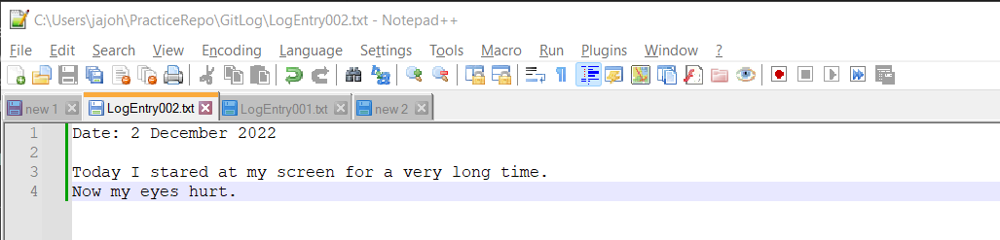

Running `git status` shows that the file has, indeed, changed:

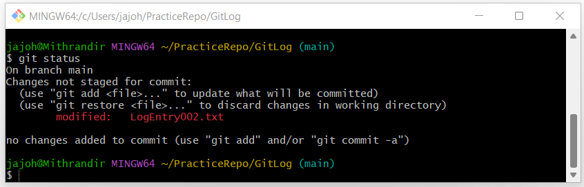

Now, run diff:

```
git diff LogEntry002.txt
```

Your result will be different from mine, but will look something like this:

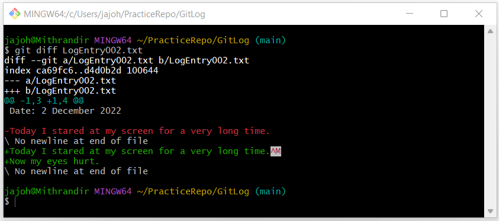

Reading the output of Diff can be a bit daunting. There is a very good explanation here: [Git Diff](https://www.atlassian.com/git/tutorals/saving-changes/git-diff). But there is also a quick fix that makes the output more obvious. Let's use a switch in our command. Enter the command:

```
git diff --color-words LogEntry002.txt
```
 Now your output will look something like this:

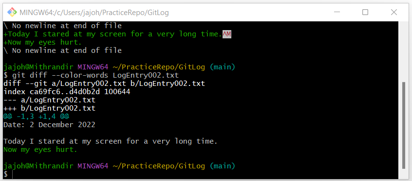

This is easier to parse. The most important portion of the output is the last two lines, and it is simple to read. Any text in white is text that has not changed between the files. Anything in color has; if the color is green, it means the text was added. If it is red, it means it was removed. To show this, let's do a few things.

First, let's restore the file back to its original condition. Since nothing has been either added or committed, lets go back to our last commit:

```
git reset --hard
```

That served the purpose of resetting LogEntry002.txt back to its state before I modified it by adding the second line. Now, instead of adding a line, I'm going to subtract a few words so that it now reads like this:

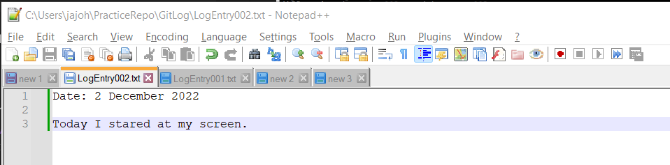

Now, let's use Diff again:

```
git diff --color-words LogEntry002.txt
```
 Now your output will look something like this:

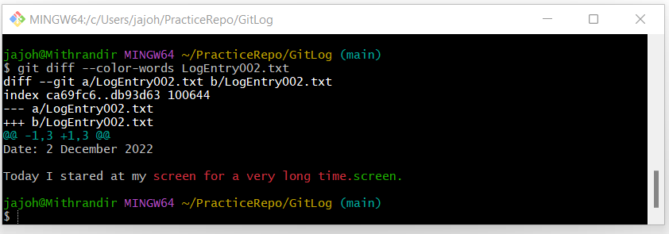

Now, the words that were removed are indicated in red. 

One other use of Diff that is handy to know at this point is using it to compare *committed versions* of files. To do this, we provide Diff with commit hashes as arguments. First, reset back to our original state using reset as above.

*Hint: Most terminals allow you to use the up arrow to move backwards through previously entered CLI commands. Since we just used reset, instead of typing it out again, use the up arrow a few times and the command will be there. When you find it, just hit enter.*

Now let's use diff to find the differences in all files that have changed between our first commit and our second commit:

```
git diff --color-words f213bc 67c967
```

Of course, make sure you refer to your own hash numbers here. The output should look something like this:

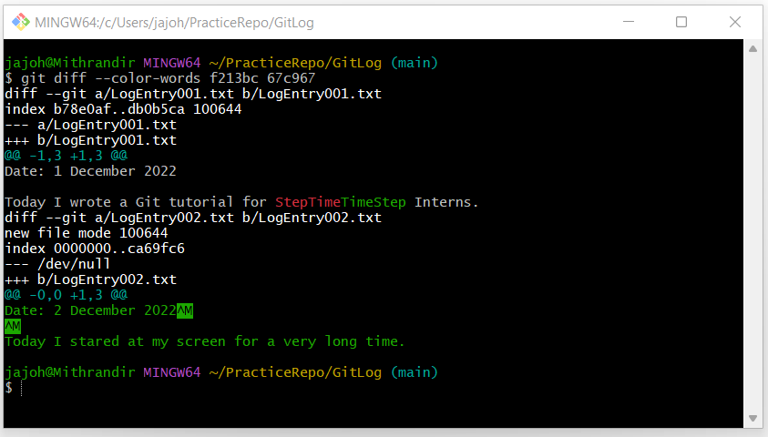

The first change that you see is my intial change where I corrected 'TimeStep.' It shows that I removed the incorrect 'StepTime' (red) and added the correct 'TimeStep' (green).

The second change is a bit more interesting... the entire content of the file is in green... why? Because the file didnt exist in the first commit... we added the file in the second commit, so the entire content of the file is expressed as a (green) addition.

I encourage you to play around with the diff command... it is one of Git's more powerful commands to help you examine the changes you've made over time.

This is enough information to do your journal entries. But there is one last bit of knowledge I'd like you to absorb:

## Brief Detour: The Fine Art of Branching

This is an introduction to something we will talk extensively about in the next presentation, but for now, a bit of background knowledge is conceptually useful. 

To start with, let's use a visual to represent the history of a repository. 

Let's say you establish a repository for a coding project your working on (We'll call it 'Reconstructor'). You do this by selecting the top directory on your machine that contains all of your project files, (both in itself and in its subdirectories), and then initializing it (cd to the directory and use `init`). You then stage (`add`) and commit (`commit`) all these files, creating a repository out of all of your code. The database is now the initial snapshot of your project, commit #1. This is also the beginning of your 'Main' branch. (*Elements of this image taken from Atlassian Branching Tutorial*.)

We'll represent commits as filled in circles, where the color represents a particular path, or branch, and the six character label is the first six characters in the hash string, which uniquely identifies that commit. (To make it easier to follow, the commits in this visual are sequentially ordered by their first digit. It won't be like that IRL.) So, to start with:


Now, you decide to work on your code a bit, make several cool and interesting changes, are happy with them, and decide to make another commit. Now we have:


Ben, an optics friend of yours, takes a look at your code, and says 'with just a few changes, this code would be perfect for running a component on my testbed!' You don't mind making a few changes and giving him the code, but you really dont want those changes in YOUR version. So, you create a branch (with the `git branch` command) and name it "BenCode", make the changes he wants, and then make another commit. 


Now, a few things happen in rapid progression. You go into a coding frenzy, and make several more commits as you add features and routines to your code. By now its good enough to run on your bench. While you are in the middle of doing this, Ben comes back and says 'I need you to add a bit of functionality' (Bob is not that great of a coder himself, apparently), so you upadate his version of the code with the desired changes, and make another commit to his branch. 

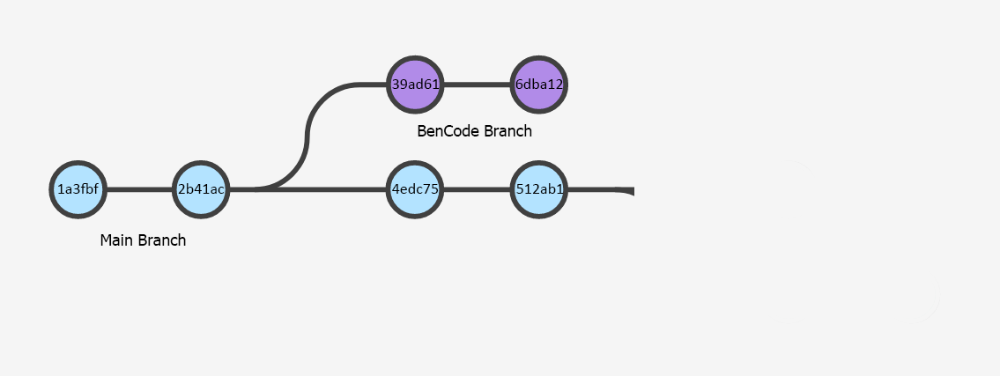

You decide to publish your reconstructor code in a journal, but need to make a few changes to make it more generic and easier to adopt, so you create another branch, call it 'PublishCode', make some changes, and do another commit. After your referee bounces it back to you with her 'suggested' changes, you make a final commit to that branch, and the code is published. Meanwhile, you've added hardware to your bench and have to change your code again. Another commit, and you are done, at least for now (or until Ben knocks on your office door again).


Git, through different commands, allows you to choose to revisit any commit, create branches, switch branches, etc. The `git checkout` command the we used above is one such command. 

There are multiple reasons you may want to **branch** a repository. Maybe you don't like anything you've done to your files since that awful day three days ago when your brain went south and nothing went right... or maybe you want to try out two different approaches to your project and are not sure which will yield the best result... or maybe you have a great idea, but are not sure whether or not it will work as well as you think it will... or maybe you want to let a friend work on your code at the same time you do. Branching creates a cloned repsoitory, seperate from your main (or master) repository. You can work on these branches while your 'preferred' copy of your files is safe and undisturbed.... or while that awful version of your changes fades into the past. And you can allow others to collaborate. 

GitHub, our next subject, is all about branching and collaborating. 

## Part Two: The Project

Now that you've run through the tutorial, you have adequate tools to practice CLI Git. The project portion is simple: over the vacation, create a journal with ten entries in it, one entry per whichever ten days you pick. An entry is, of course, just a file in a directory that has been Git initiated.

Write a few lines in each of those files when you create them. It doesnt have to be a lot, the point here is not to be time consuming, but to illustrate how to use Git. Maybe write down something you've done, something you've thought about, or maybe something you have planned.

Add and commit the files when you are finished creating them. Use git log to see your commits, their hash IDs, and the other info the log provides.

If you've ever kept a log, or a journal, and are anything like me, I am constantly going back to previous days in my log and adding things or changing things based on remembering information or realizing that I could describe something better than I had on the day I wrote it. Since I like to work with ink and paper, this leads to a lot of line-outs and writing in the margins. With Git, however, you can make changes to previous entries without the messiness factor.

Remember, the whole purpose of Git is to easily keep track of changes to files. Therefore, I also want you to go back to previous entries and make changes. Even if you are a perfect writer and capture everything exactly as you want it, go back and make some kind of change to previous entries. Make something up. Change the color of the car that hit a puddle and splashed you as it went around a corner. ADD a car that splashed you as it went around a corner. Better yet, make it a self-driving car that you could swear intentionally splashed you. 

After you've made these changes, go back and use `git diff' to see them and get a feel for how it works.

Also, experiment with loss revocery... erase a few of your entries. Recover them. 

When you are finished with your ten entries, do a git log command and screen shot the results, showing your commits. Also, pick three of the changes you made, run Git Diff in anyway you want, and screenshot that output. Bring those with you to the next presentation.

You don't have to spend a lot of time on this, but please spend some. It will make your assimilation into the world of Git so much easier...

## References

More than just those few requirements, though, take the opportunity to play with the commands, see what they do, learn about available switches, etc. Here are a few references that might help.

- The [Pro Git](https://git-scm.com/book/en/v2) book that I mentioned in the presentation is an excellent reference. 

- The [GitHub Git Cheat Sheet](https://education.github.com/git-cheat-sheet-education.pdf) is a good reference for a lot of what we've just talked about.

- The [50 Git Commands You Shoul Know](https://www.freecodecamp.org/news/git-cheat-sheet/) cheat sheet covers a lot of this, as well as having a bunch of more advanced commands that you will eventually need.

- And the [Git Glossary](https://www.atlassian.com/git/glossary) not only has a list of Git commands and what they do, but also has references to tutorials on the use of each of them.

## Have a Great Vacation!


